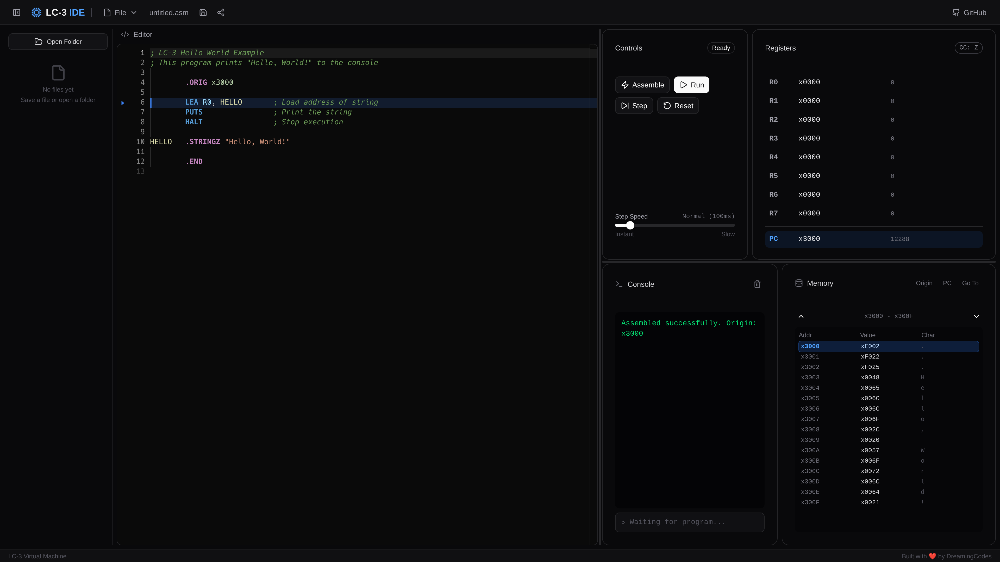

# rustylc3

A fast LC-3 virtual machine, assembler, and CLI written in Rust.

**[Try the Online IDE](https://rustylc3.dreaming.codes)**



## Features

- LC-3 assembler with two-pass assembly
- LC-3 virtual machine for program execution
- Command-line interface for assembling and running programs
- A full-fledged in-browser IDE for experimenting with LC-3 that works completely offline

## Benchmarks

Performance comparison between rustylc3 and lc3sim (reference C implementation):

| Benchmark | rustylc3 | lc3sim | Speedup |
|-----------|----------|--------|---------|
| fibonacci | 1.1 ms | 5.0 ms | **4.5x faster** |
| bubble_sort | 1.4 ms | 5.7 ms | **4.1x faster** |
| multiply | 1.0 ms | 5.1 ms | **5.2x faster** |
| prime_sieve | 2.2 ms | 8.4 ms | **3.8x faster** |
| memory_stress | 1.7 ms | 7.2 ms | **4.2x faster** |
| nested_loops | 6.9 ms | 22.0 ms | **3.2x faster** |
| subroutine_calls | 1.3 ms | 5.8 ms | **4.5x faster** |

rustylc3 is **3-5x faster** than lc3sim across all benchmarks.

> Run your own benchmarks with `./benchmark.sh`

## Project Structure

```
rustylc3/
├── lc3-core/       # LC-3 Virtual Machine implementation
├── lc3-parser/     # LC-3 assembly language parser
├── lc3-assembler/  # Two-pass LC-3 assembler
├── lc3-cli/        # Command-line interface
└── benchmarks/     # Benchmark programs
```

## License

See [LICENSE](LICENSE) for details.
